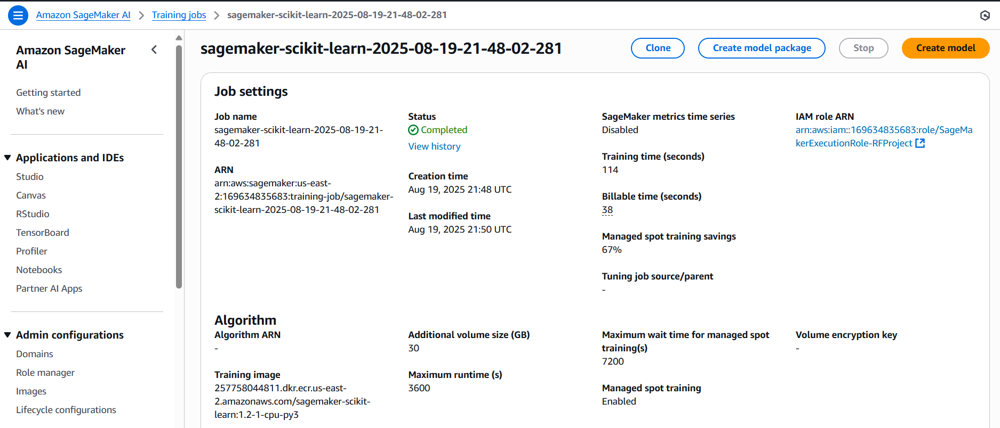
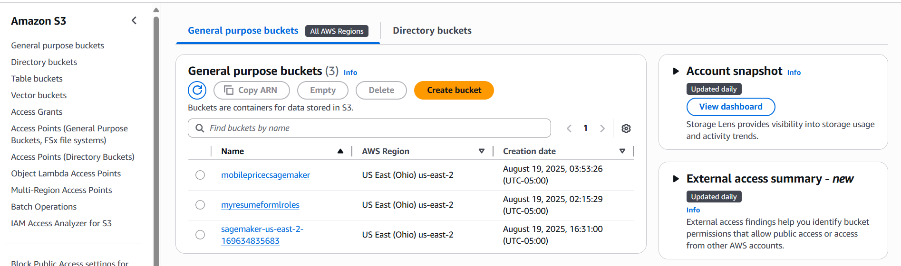
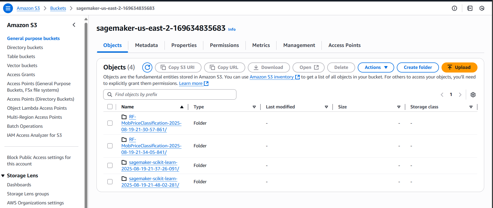
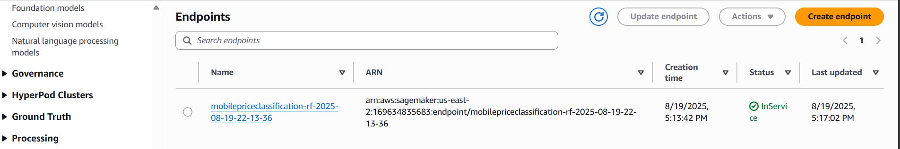

# Mobile Price Classification — End‑to‑End on Amazon SageMaker

An end‑to‑end ML pipeline that trains a **Random Forest** to classify mobile price ranges, using:
**pandas** for prep, **Amazon S3** for data, and **Amazon SageMaker (SKLearn)** for training & (optional) deployment.

## 🔧 What you’ll do
1. Load and sanity‑check the dataset.
2. Split into train/test and persist CSVs.
3. Upload to S3 under a clean prefix: `s3://<bucket>/sagemaker/mobile_price_classification/sklearncontainer/`.
4. Train with the SageMaker SKLearn container (Script Mode).
5. (Optional) Deploy an HTTPS endpoint and run real predictions.
6. Clean up to stop the meter.

## 🧭 Architecture
```
Local Notebook  →  S3 (train/test CSVs)
       │
       └──► SageMaker Training (SKLearn container runs script.py)
                    │
          model.tar.gz (S3)
                    │
        (optional) SageMaker Endpoint  ⇄  Real-time inference
```

## 🚀 Quickstart
- Open `mobpriceclassification_polished.ipynb`.
- Set your **region**, **SageMaker execution role**, and **S3 bucket**.
- Run the cells top‑to‑bottom. For cheaper training, set `use_spot_instances=True` and `max_wait ≥ max_run`.

## 💸 Cost tips
- Prefer `ml.c5.*` / `ml.c6i.*` for CPU training.
- Enable **Managed Spot Training** when quotas allow.
- **Delete the endpoint** after testing.

---

**Files**
- `mobpriceclassification_polished.ipynb` — the full, annotated notebook.
- `script.py` — the training entry point executed inside the SKLearn container (created by the notebook).
- ## 🖼️ Screenshots

**Training job (completed, Spot savings)**  


**S3 buckets (region us-east-2)**  


**S3 artifacts (training outputs & model)**  


**Deployed endpoint (InService)**  


